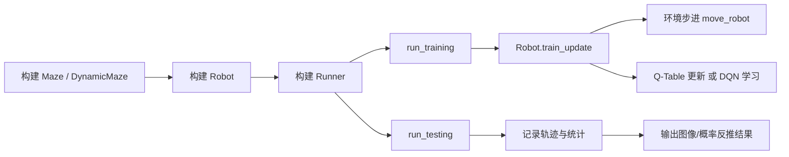
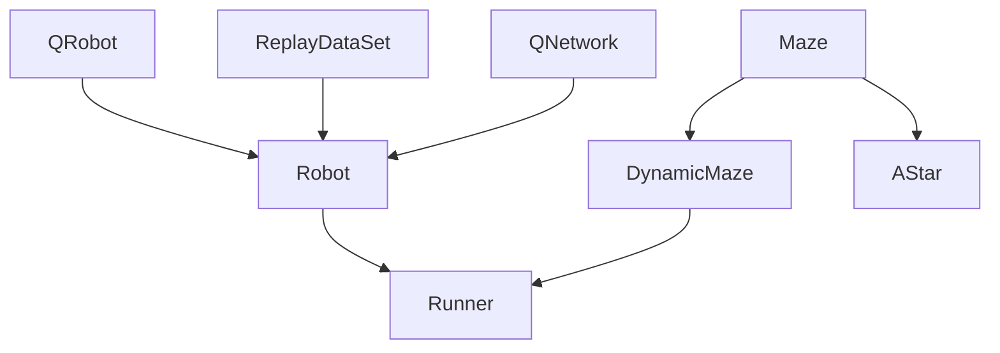
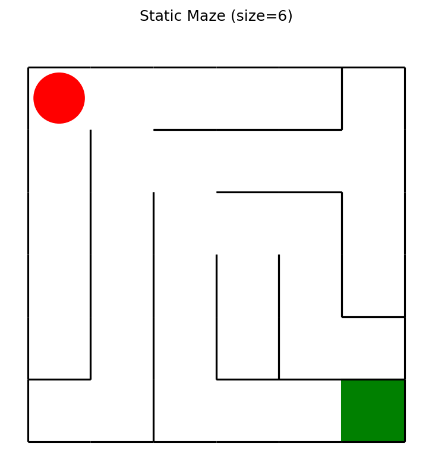
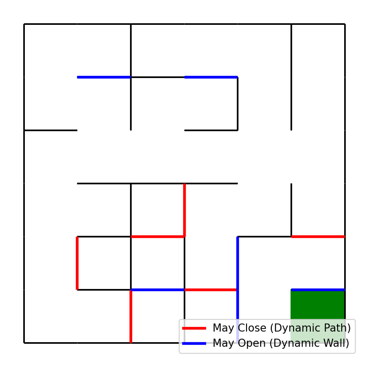
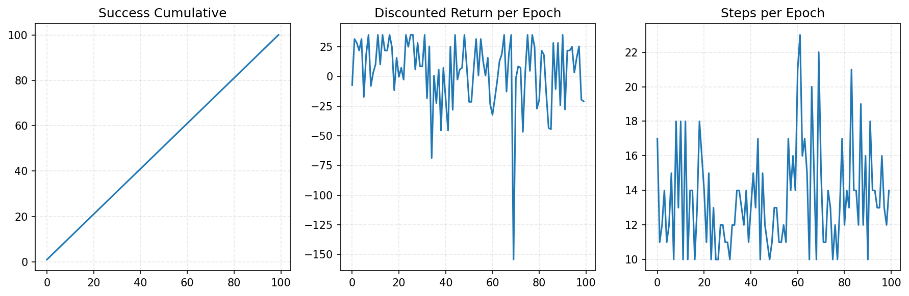
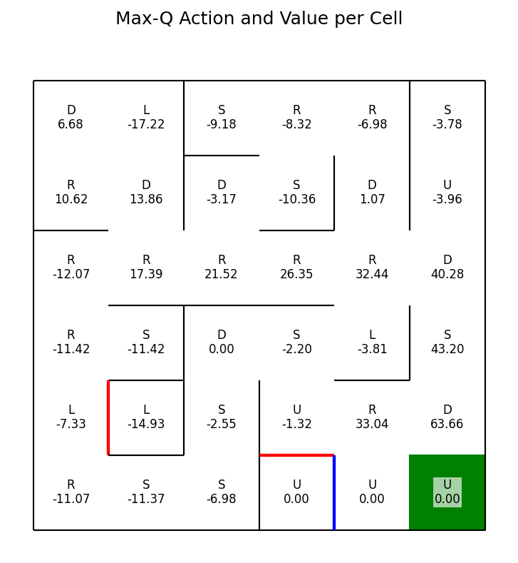
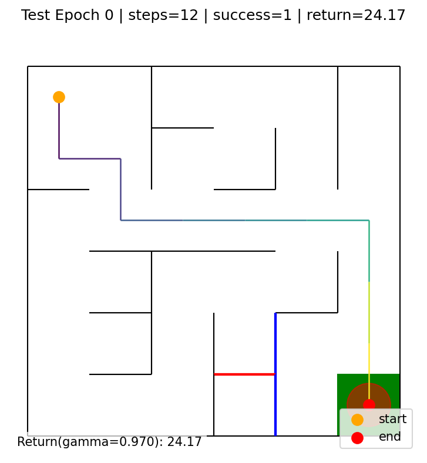
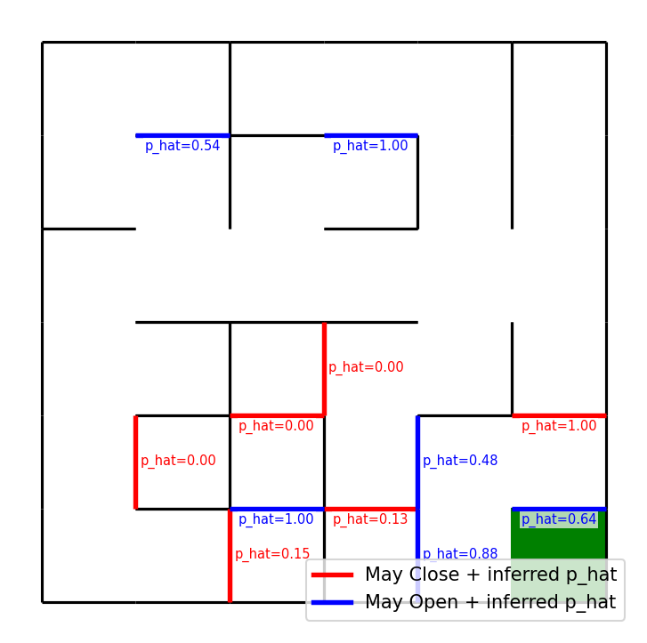
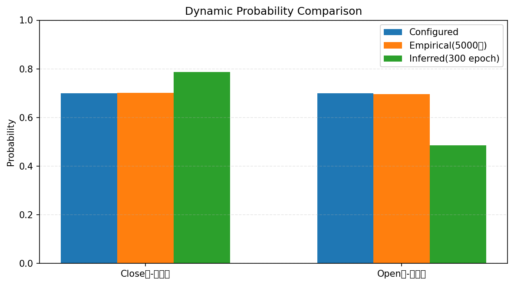

# QMaze 技术展示文档（中文版）

> 文档目标：系统化、可复现地展示 QMaze 项目的技术实现、代码组织、算法机制与实验结果。

---

## 1. 项目简介

QMaze 是一个以网格迷宫为环境的强化学习项目，核心目标是训练机器人在复杂迷宫中到达终点，并进一步在**动态环境**中推断隐含动力学参数（墙体开闭概率）。

项目同时包含：
- 经典搜索基线：A*（`/home/runner/work/QMaze/QMaze/AStar.py`）
- 表格法强化学习：Q-Table（`/home/runner/work/QMaze/QMaze/QRobot.py` + `Robot(..., algorithm='qtable')`）
- 深度强化学习：DQN（`/home/runner/work/QMaze/QMaze/Robot.py` + `torch_py/QNetwork.py`）
- 动态环境建模：`/home/runner/work/QMaze/QMaze/DynamicMaze.py`
- 训练调度与可视化：`/home/runner/work/QMaze/QMaze/Runner.py`

---

## 2. 技术栈与工程构成

| 类别 | 使用技术 | 作用 |
|---|---|---|
| 数值计算 | NumPy | 迷宫状态、特征向量、统计计算 |
| 深度学习 | PyTorch | DQN 网络定义、前向推理与反向训练 |
| 可视化 | Matplotlib | 迷宫渲染、训练曲线、Q 值图、轨迹图 |
| 训练流程 | 自定义 Runner | 训练/测试循环、记录与导图 |
| 算法 | Q-Learning / DQN / A* | 路径规划、策略学习、对比基线 |

项目关键目录（核心文件）如下：

```text
/home/runner/work/QMaze/QMaze
├── Maze.py
├── DynamicMaze.py
├── QRobot.py
├── Robot.py
├── ReplayDataSet.py
├── Runner.py
├── DQNTrain.py
├── AStar.py
├── DrawStatistics.py
└── torch_py/
    ├── QNetwork.py
    └── MinDQNRobot.py
```

---

## 3. 系统架构与数据流

### 3.1 训练总体流程图



### 3.2 模块依赖关系



---

## 4. 环境建模：静态迷宫与动态迷宫

## 4.1 静态迷宫（`Maze.py`）

### 设计要点
1. 迷宫每个格子有 4 个方向位（上右下左），0 表示有墙，1 表示可通行。
2. 使用 Prim 随机算法生成连通迷宫。
3. 提供统一动作集：`['u','r','d','l']`。
4. 提供奖励机制：撞墙、到达终点、普通步。

### 核心代码片段（来自 `Maze.py`）

```python
self.valid_actions = ['u', 'r', 'd', 'l']
self.direction_bit_map = {'u': 1, 'r': 2, 'd': 4, 'l': 8}
self.move_map = {
    'u': (-1, 0),
    'r': (0, +1),
    'd': (+1, 0),
    'l': (0, -1),
}
```

### 结果截图（静态迷宫）



---

## 4.2 动态迷宫（`DynamicMaze.py`）

`DynamicMaze` 继承 `Maze`，在每一步移动前刷新墙体状态：
- 从“原本可通行的边”中采样一批作为 `dynamic_close_doors`（有概率临时关闭）
- 从“原本不可通行的边”中采样一批作为 `dynamic_open_doors`（有概率临时打开）
- 增加动作 `'s'`（原地等待）以适配随机环境

### 核心机制代码片段

```python
if 's' not in self.valid_actions:
    self.valid_actions.append('s')
self.move_map['s'] = (0, 0)
```

```python
def move_robot(self, direction):
    self.update_dynamic_walls()
    if direction == 's':
        self.robot['dir'] = direction
        if self.robot['loc'] == self.destination:
            return self.reward['destination']
        return self.reward['default']
    return super(DynamicMaze, self).move_robot(direction)
```

### 动态候选边可视化（红=可能关闭，蓝=可能打开）



---

## 5. 强化学习智能体设计

## 5.1 QRobot 基类（`QRobot.py`）

`QRobot` 提供：
- Q 表结构管理
- epsilon 探索参数
- 表格更新接口

典型更新公式：

\[
Q(s,a) \leftarrow Q(s,a) + \alpha \left(r + \gamma \max_{a'}Q(s',a') - Q(s,a)\right)
\]

## 5.2 Robot 统一实现（`Robot.py`）

`Robot` 通过 `algorithm` 参数同时支持：
- `qtable`：表格法
- `dqn`：神经网络近似

### 状态特征工程
项目将状态从二维坐标扩展为 6 维：
- `(x, y)`
- 四方向可通标记 `(wu, wr, wd, wl)`

代码实现：

```python
def get_state_feature(self, loc):
    valid_moves = self.maze.can_move_actions(loc)
    walls = [1.0 if a in valid_moves else 0.0 for a in self.wall_directions]
    return tuple(list(loc) + walls)
```

### 奖励塑形（距离惩罚）
在非终点状态加入归一化距离惩罚，提升策略收敛效率与路径质量。

```python
normalized_dist = dist / max_dist
reward = reward - normalized_dist * self.distance_weight
```

## 5.3 DQN 网络（`torch_py/QNetwork.py`）

网络结构为两层全连接 ReLU：

```python
self.input_hidden = nn.Sequential(
    nn.Linear(state_size, hidden_size),
    nn.ReLU(),
    nn.Linear(hidden_size, hidden_size),
    nn.ReLU(),
)
self.final_fc = nn.Linear(hidden_size, action_size)
```

---

## 6. 经验回放与训练调度

## 6.1 ReplayDataSet（`ReplayDataSet.py`）

- 存储格式：`(state, action_index) -> Row(state, action, reward, next_state, is_terminal)`
- 支持随机采样批训练
- 支持 `build_full_view` 对全图状态动作进行预填充

## 6.2 Runner（`Runner.py`）

`Runner` 负责完整实验生命周期：
- `run_training(...)`：训练多 epoch
- `run_testing(...)`：测试并记录轨迹
- `save_max_q_image(...)`：导出每个格子的最优动作与 Q 值
- `save_dynamic_probability_image(...)`：动态边概率反推结果图
- `generate_gif(...)`：测试过程动画

---

## 7. 动态边概率反推（项目亮点）

在 `Runner.infer_dynamic_edge_probabilities` 中，项目基于当前策略的 Q 值与分支回报关系，对动态边概率进行反推估计。

对“动态关闭边”的核心关系：

\[
Q(s,a) = p_{close} \cdot G_{hit} + (1-p_{close}) \cdot G_{pass}
\]

从而可解得：

\[
p_{close} = \frac{Q(s,a)-G_{pass}}{G_{hit}-G_{pass}}
\]

工程实现中加入：
- 局部墙状态穷举求条件期望
- 多轮平滑迭代更新（近似 EM 思路）
- 分母接近 0 的数值稳定性处理（`eps`）

---

## 8. 实验展示（本仓库内复现结果）

> 以下结果由本次文档生成过程在仓库中直接运行得到，指标文件：`docs/assets/demo_summary.json`。

## 8.1 实验配置

| 参数 | 值 |
|---|---|
| 迷宫尺寸 | 6x6 |
| 动态关闭概率 `prob_close` | 0.3 |
| 动态打开概率 `prob_open` | 0.7 |
| 算法 | Q-Table (`Robot(..., algorithm='qtable')`) |
| 训练 epoch | 300 |
| 每 epoch 步数上限 | 80 |
| 测试 epoch | 1 |
| 测试步数上限 | 120 |

## 8.2 训练曲线图（成功累计 / 折扣回报 / 步数）



关键指标（来自 `demo_summary.json`）：
- 训练累计成功次数：`100 / 300`
- 最近 50 轮平均折扣回报：`-0.0298`
- 最近 50 轮平均步数：`14.22`
- 测试成功：`1`（成功到达终点）
- 测试折扣回报：`24.1670`
- 测试步数：`12`

## 8.3 Q 值策略图（每个格子的最佳动作与值）



## 8.4 测试轨迹截图



## 8.5 动态概率反推图（含 p_hat 标注）



反推统计：
- 有效估计边数：`12 / 12`
- 关闭边平均估计概率：`0.2132`（目标 `0.3`）
- 打开边平均估计概率：`0.4851`（目标 `0.7`）

说明：该结果来自轻量训练配置（300 epoch），用于展示工程链路可运行性；提升训练轮数与采样覆盖后，估计稳定性通常会改善。

## 8.6 环境真值校验与差异解释

为验证“环境本身是否按设定概率运行”，额外做了 5000 步环境采样校验（不依赖策略网络，仅调用 `update_dynamic_walls`）：

- 期望开通率（close 边）：`1 - prob_close = 0.7`
- 期望开通率（open 边）：`prob_open = 0.7`
- 实测开通率（close 边均值）：`0.7013`
- 实测开通率（open 边均值）：`0.6952`

对应文件：`docs/assets/dynamic_ground_truth_check.json`。

对比图如下（配置值 vs 实测值 vs 反推值）：



结论：环境动态机制本身是正确的；当前偏差主要来自“轻量训练下的价值估计误差”，而非环境实现错误。

---

## 9. 代码组织与可维护性评价

### 优点
1. **分层清晰**：环境（Maze）/ 智能体（Robot）/ 调度（Runner）分离良好。
2. **算法兼容**：单个 `Robot` 类统一 Q-Table 和 DQN，两者可切换。
3. **可视化完善**：具备迷宫、策略、轨迹、统计、概率标注等多视角输出。
4. **研究价值**：不仅做控制（导航），还做逆向推断（动力学概率）。

### 可继续优化点
1. 增加标准化配置入口（如 `yaml`）和实验管理脚本。
2. 增加单元测试与回归测试，保障重构稳定性。
3. 将 `DQNTrain.py` 的实验参数模块化，便于批量对照实验。
4. 增加日志结构化落盘（CSV/JSONL）以支持统计分析。

---

## 10. 复现实验（文档素材生成命令）

在仓库根目录执行：

```bash
cd /home/runner/work/QMaze/QMaze
python - <<'PY'
import os, random, json
import numpy as np
import matplotlib
matplotlib.use('Agg')
import matplotlib.pyplot as plt
from Maze import Maze
from DynamicMaze import DynamicMaze
from Robot import Robot
from Runner import Runner

random.seed(42)
np.random.seed(42)
os.makedirs('docs/assets', exist_ok=True)

maze = Maze(maze_size=6)
fig = plt.figure(figsize=(6,6))
maze.draw_maze(); maze.draw_robot()
fig.savefig('docs/assets/static_maze.png', dpi=150, bbox_inches='tight')
plt.close(fig)

maze_dyn = DynamicMaze(maze_size=6, prob_close=0.3, num_close=6, prob_open=0.7, num_open=6)
maze_dyn.save_dynamic_candidates_image('docs/assets/dynamic_candidates.png')

robot = Robot(maze=maze_dyn, algorithm='qtable')
runner = Runner(robot=robot)
runner.run_training(training_epoch=300, training_per_epoch=80, epoch_image_dir=None)
runner.save_max_q_image('docs/assets/max_q_map.png', use_target_model=True)
runner.run_testing(testing_epoch=1, testing_per_epoch=120, epoch_image_dir='docs/assets')
prob_items = runner.save_dynamic_probability_image('docs/assets/dynamic_inferred_probs.png', use_target_model=True, decimals=2)

success_cumsum = np.cumsum(np.array(runner.train_robot_statics['success']))
returns = np.array(runner.train_robot_statics['reward'])
steps = np.array(runner.train_robot_statics['times'])

fig = plt.figure(figsize=(12,4))
plt.subplot(1,3,1); plt.title('Success Cumulative'); plt.plot(success_cumsum); plt.grid(alpha=0.3, ls='--')
plt.subplot(1,3,2); plt.title('Discounted Return per Epoch'); plt.plot(returns); plt.grid(alpha=0.3, ls='--')
plt.subplot(1,3,3); plt.title('Steps per Epoch'); plt.plot(steps); plt.grid(alpha=0.3, ls='--')
fig.tight_layout()
fig.savefig('docs/assets/training_curves.png', dpi=150, bbox_inches='tight')
plt.close(fig)

summary = {
    'maze_size': int(maze_dyn.maze_size),
    'prob_close': float(maze_dyn.prob_close),
    'prob_open': float(maze_dyn.prob_open),
    'train_epochs': 300,
    'train_steps_cap': 80,
    'final_success_cumsum': int(success_cumsum[-1]) if len(success_cumsum) else 0,
    'avg_return_last50': float(np.mean(returns[-50:])) if len(returns) >= 50 else float(np.mean(returns)) if len(returns) else 0.0,
    'avg_steps_last50': float(np.mean(steps[-50:])) if len(steps) >= 50 else float(np.mean(steps)) if len(steps) else 0.0,
    'test_success': int(runner.test_robot_statics['success'][-1]) if len(runner.test_robot_statics['success']) else 0,
    'test_discounted_return': float(runner.test_robot_statics['reward'][-1]) if len(runner.test_robot_statics['reward']) else 0.0,
    'test_steps': int(runner.test_robot_statics['times'][-1]) if len(runner.test_robot_statics['times']) else 0,
    'dynamic_prob_valid_count': int(sum(1 for x in prob_items if x.get('valid'))),
    'dynamic_prob_total': int(len(prob_items)),
}
with open('docs/assets/demo_summary.json', 'w', encoding='utf-8') as f:
    json.dump(summary, f, ensure_ascii=False, indent=2)
PY
```

本次已生成的展示素材位于：
- `/home/runner/work/QMaze/QMaze/docs/assets/static_maze.png`
- `/home/runner/work/QMaze/QMaze/docs/assets/dynamic_candidates.png`
- `/home/runner/work/QMaze/QMaze/docs/assets/training_curves.png`
- `/home/runner/work/QMaze/QMaze/docs/assets/max_q_map.png`
- `/home/runner/work/QMaze/QMaze/docs/assets/test_epoch_0000.png`
- `/home/runner/work/QMaze/QMaze/docs/assets/dynamic_inferred_probs.png`
- `/home/runner/work/QMaze/QMaze/docs/assets/dynamic_probability_comparison.png`
- `/home/runner/work/QMaze/QMaze/docs/assets/demo_summary.json`
- `/home/runner/work/QMaze/QMaze/docs/assets/dynamic_ground_truth_check.json`

---

## 11. 结论

QMaze 已具备从**环境建模**、**策略学习**到**结果可视化与参数反推**的完整技术闭环。其工程设计兼顾教学可读性与研究扩展性，适合作为：
- 强化学习课程项目
- 动态环境导航实验基线
- 逆向推断（环境动力学识别）原型系统
